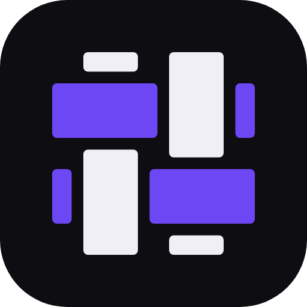

<p align="center">
  
</p>

<h1 align="center">Kete Code</h1>

<p align="center"><strong>One agent. Any model. Every editor.</strong></p>

<p align="center">
  <a href="https://github.com/kete-org/kete-releases/releases/latest"></a>
  <a href="https://www.npmjs.com/package/@ketecode/cli"></a>
  <a href="https://github.com/kete-org/ketecode/actions/workflows/kete-build.yml"></a>
  <a href="https://marketplace.visualstudio.com/items?itemName=ketecode.kete-code"></a>
  <a href="https://open-vsx.org/extension/ketecode/kete-code"></a>
  <a href="../NOTICE"></a>
</p>

<p align="center">
  <a href="https://ketecode.ai">Website</a> ·
  <a href="#install">Install</a> ·
  <a href="https://github.com/kete-org/kete-releases/releases">Releases</a> ·
  <a href="CONTRIBUTING.md">Contributing</a> ·
  <a href="SECURITY.md">Security</a>
</p>

Kete Code is an AI coding agent for your terminal and editor. It reads your project, plans the
change, edits files, runs your builds and tests with your permission, and tells you honestly what
it did. Use Claude, GPT, Gemini, a local model or any OpenAI-compatible endpoint, with your own
keys or through one Kete account.

This repository is the open-source runtime: the agent, the `kete` CLI and the editor extensions,
under the MIT License and [built on OpenCode](#built-on-opencode). The Kete portal, model gateway
and other hosted services are run separately and are not part of it.

```text
$ kete
> add rate limiting to POST /api/upload, 10 requests a minute per key

  read   src/app/api/upload/route.ts
  edit   src/lib/rate-limit.ts            +38
  edit   src/app/api/upload/route.ts      +6 −1
  ask    run `npm test -- rate-limit`?    allow
  ✓ 3 passed · 2 files changed · ready for review
```

## Install

```sh
curl -fsSL https://ketecode.ai/cli/install | sh          # macOS and Linux
irm https://ketecode.ai/cli/install.ps1 | iex            # Windows (PowerShell)
brew install kete-org/tap/kete                           # Homebrew
npm install -g @ketecode/cli                             # npm (Node.js 20+)
```

The install scripts check the release's Sigstore signature and SHA-256 checksums before installing
anything, and never ask for sudo or administrator rights. On Alpine, run `apk add libstdc++ libgcc`
first. `kete upgrade` updates in place and verifies every download against a pinned signing key.
Options (`KETE_VERSION`, `KETE_INSTALL_DIR`, …) are on [ketecode.ai/install](https://ketecode.ai/install).

### In your editor

| Editor | Install |
|---|---|
| **VS Code** | [VS Code Marketplace](https://marketplace.visualstudio.com/items?itemName=ketecode.kete-code), or `code --install-extension ketecode.kete-code` |
| **Windsurf, Cursor, VSCodium** | [Open VSX](https://open-vsx.org/extension/ketecode/kete-code): search "Kete Code" in the Extensions view |
| **JetBrains IDEs** (IntelliJ IDEA, PyCharm, WebStorm, GoLand, … 2024.3+) | coming to the JetBrains Marketplace; until then, the per-OS plugin zips on [the releases](https://github.com/kete-org/ketecode/releases/latest) install with **Settings → Plugins → ⚙ → Install Plugin from Disk…** |

The editor extensions include the `kete` runtime (the JetBrains Marketplace build downloads it on
first use, after asking, and verifies its signature before running it), so there is nothing else to
install.

## Get started

```sh
cd your-project
kete                              # interactive session in this directory
kete run "explain the auth flow"  # one-shot, prints the answer
kete auth login                   # add a model provider key (Anthropic, OpenAI, Google, …)
kete login                        # or sign in to a Kete account to use the gateway
```

## What it does

- **Works in your repository.** Searches and reads only the files that matter, edits across
  files, runs commands, builds and tests, diagnoses failures and tries again, then summarizes the
  diff.
- **Asks before it acts.** Every tool goes through allow / ask / deny permissions. Turn on "ask
  before edits" to approve each change, and keep destructive commands, package installs and
  `git push` behind a prompt.
- **Plans first when you want it to.** The `plan` agent drafts an approach without touching files;
  the default `build` agent carries it out. Starter role agents (Code Reviewer, QA, Docs Writer,
  Security, DevOps) cover common jobs, and subagents can work in parallel in their own git
  worktrees.
- **Any model.** Your own provider keys, local models through Ollama, vLLM or any
  OpenAI-compatible server, or the Kete gateway with one sign-in and readable per-request usage.
  The gateway and portal are never required for local use.
- **Extensible.** MCP servers (`kete mcp`), skills, plugins and multi-step workflows.
- **One runtime, every surface.** The terminal UI, the VS Code and JetBrains extensions and other
  clients all talk to the same local `kete` server, so a session started in one continues in
  another.
- **Unattended and cloud runs.** `kete job run` runs an agent unattended within a budget and a time
  limit, failing closed on anything not allowed. Cloud jobs on Kete's infrastructure or on your own
  servers ([self-hosted job hosts](../docs/job-hosts.md)) are in preview.

Your code leaves your machine only as model context for the provider you configured. OpenCode's
hosted services are off by default.

## Local models

Run models on your own machine or network with Ollama, LM Studio or vLLM, no account needed:

```sh
ollama serve                          # Kete finds it on its default port
kete models pull qwen2.5-coder:7b     # pull through your Ollama, then it's listed
OLLAMA_HOST=192.168.1.20 kete         # a GPU box on your LAN (or KETE_OLLAMA_HOST)
kete --offline                        # local models only, no other network calls
```

The model picker groups them under **Local**, marks models that can't call tools, shows their
context size, and tells you when a server you set up can't be reached. Offline mode keeps
enforcing your organization's cached policy. Details: [docs/local-models.md](../docs/local-models.md).

## Integrations

Built-in MCP presets connect a session to tools your team already uses, read-only or ask-first by
default, with credentials in your OS credential store:

```sh
kete mcp presets                      # what's available
kete mcp add harness                  # Harness (read-only unless --write)
kete mcp add slack --client-id <id>   # Slack (needs an approved Slack app)
```

Details: [Harness](../docs/integrations/harness.md), [Slack](../docs/integrations/slack.md).

## Configuration

Global settings live in `~/.config/kete/`, project settings in `.kete/` at the repository root.
Environment variables use the `KETE_` prefix. Organizations on the Kete platform can manage
agents, skills, MCP servers and policies centrally; `kete sync` pulls them, and for security policy
the stricter setting always wins.

## Repository

| Path | What's there |
|---|---|
| `packages/cli` | the `kete` command and binary build |
| `packages/core` | agent loop, tools, sessions, providers, permissions, config |
| `packages/server`, `packages/tui`, `packages/app` | HTTP server, terminal UI, web UI (used by VS Code) |
| `packages/kete-vscode` | the VS Code extension (also Windsurf, Cursor, VSCodium via Open VSX) |
| `packages/kete-jetbrains` | the JetBrains plugin (IntelliJ Platform, Kotlin) |
| `packages/kete-job-*`, `packages/kete-egress`, `packages/kete-root-helper` | cloud job image, entrypoint, egress proxy, tool sandbox helper, self-hosted job host |
| `packages/kete-tools` | release, distribution, upstream sync and repository checks |
| `docs/` | [architecture](../docs/architecture.md), [ADRs](../docs/adr/), [release](../docs/release.md), [knowledge base](../docs/context/INDEX.md) |

Kete-specific code lives in `src/kete/` inside upstream packages, or in `packages/kete-*`.

## Build from source

Requires [Bun](https://bun.sh) (the version pinned in `package.json` `packageManager`).

```sh
bun install
bun run dev [directory]                                          # run the CLI from source
cd packages/cli && bun run build --single --skip-install --skip-web-ui   # → dist/cli-<os>-<arch>/bin/kete
```

Typecheck with `bun turbo typecheck`, lint with `bun run lint`, and run tests with `bun run test`
inside a package. [`CLAUDE.md`](../CLAUDE.md) is the rulebook for changes: architecture rules,
security rules and the checks to run.

## Built on OpenCode

Kete Code is a fork of [OpenCode](https://github.com/anomalyco/opencode) (MIT) and keeps tracking
it ([`.opencode-version`](../.opencode-version), [`docs/upstream-sync.md`](../docs/upstream-sync.md)).
Changes to upstream files are marked `kete_change` and listed in
[`docs/upstream-patches.md`](../docs/upstream-patches.md). OpenCode's own README is
[`README.md`](../README.md) at the repository root.

## Contributing, security, license

- [Contributing](CONTRIBUTING.md): issues and pull requests are welcome; please read it first.
- [Security](SECURITY.md): report vulnerabilities privately, never in a public issue.
- [Code of conduct](CODE_OF_CONDUCT.md).
- License: MIT. OpenCode's code is under its original [license](../LICENSE); Kete Code's code is
  under the MIT License stated in [`NOTICE`](../NOTICE).
